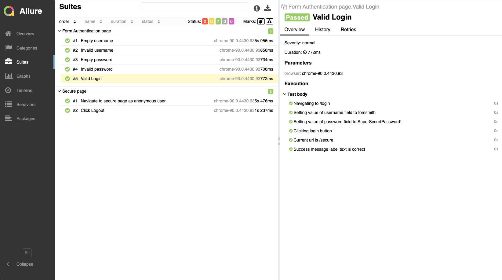

# WebdriverIO Test Framework

[](https://github.com/justinebateman/webdriverio-test-framework/actions)

This repo holds End to End tests for the Demo site here - [https://the-internet.herokuapp.com/](https://the-internet.herokuapp.com/)

Technologies used:

-   Typescript
-   WebdriverIO
-   Mocha
-   Chai
-   Page Object Pattern
-   ESlint
-   Prettier
-   Allure Reports
-   PerformanceTotal Service
-   GitHub Actions CI

Performance results are collated for each test, any performance regression can be viewed in the performance-results folder

eg.
Performance-Total results:

```bash
┌─────────┬───────────────────────────────────────────────────────────┬─────────────┬─────┬─────────┬──────────┬──────────┐
│ (index) │                           name                            │ averageTime │ sem │ repeats │ minValue │ maxValue │
├─────────┼───────────────────────────────────────────────────────────┼─────────────┼─────┼─────────┼──────────┼──────────┤
│    0    │        'Form Authentication page - Empty username'        │     655     │  5  │    7    │   639    │   681    │
│    1    │       'Form Authentication page - Invalid username'       │     550     │ 13  │    7    │   502    │   597    │
│    2    │        'Form Authentication page - Empty password'        │     535     │ 14  │    7    │   489    │   581    │
│    3    │       'Form Authentication page - Invalid password'       │     544     │  9  │    7    │   514    │   583    │
│    4    │         'Form Authentication page - Valid Login'          │     570     │ 16  │    3    │   542    │   596    │
│    5    │ 'Secure page - Navigate to secure page as anonymous user' │     304     │  0  │    1    │   304    │   304    │
│    6    │               'Secure page - Click Logout'                │     939     │  0  │    1    │   939    │   939    │
└─────────┴───────────────────────────────────────────────────────────┴─────────────┴─────┴─────────┴──────────┴──────────┘
```

## Getting Started

Install the dependencies:

```bash
npm install
```

Compile TypeScript:

```bash
npm run build
```

Run compiled e2e tests:

```bash
npm run test:dist:e2e
```

Run e2e tests:

```bash
npm run test:e2e
```

## Reports

### Allure

Run this command to generate the allure report in the directory `./test-report/allure-report`:

```bash
npm run report:generate
```

You can run this command to start a server on your machine and open the allure report on the browser:

```bash
npm run report:open
```

The generated report will display all test cases executed, along with steps and results:



## Prettier and Eslint

Run to format the code:

```bash
npm run code:format
```
